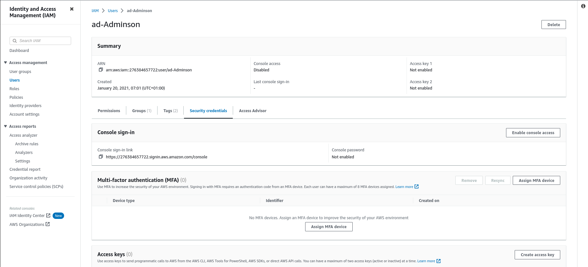
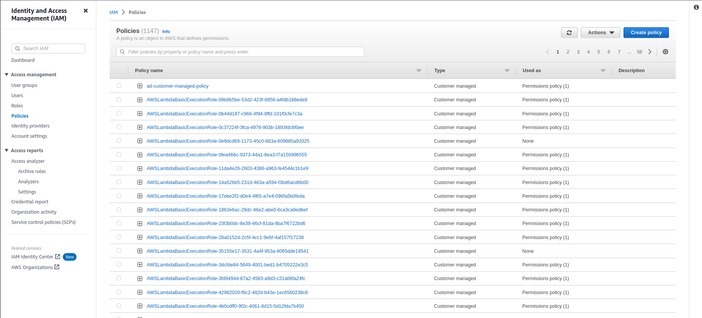
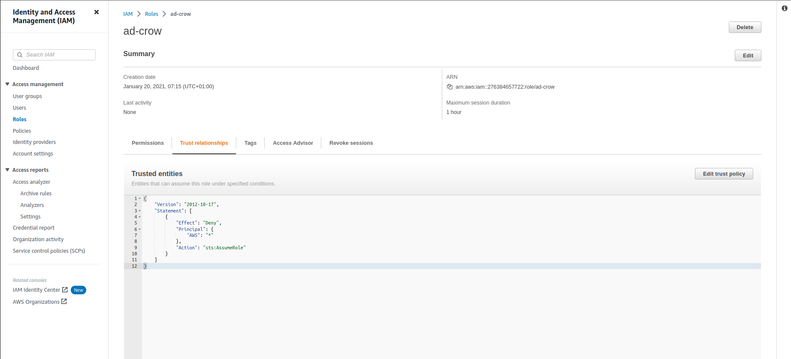
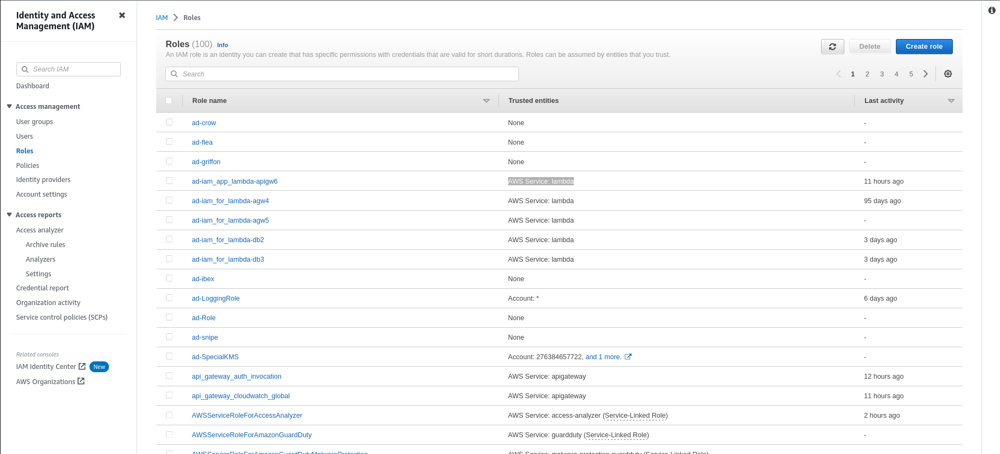

# IAM enumeration

Objective: Using the access credentials, enumerate users, roles, and policies on the AWS account

## Console Based Enumeration

1. Click on the lab link button to get access to the AWS lab credentials.
2. Sign-in into the AWS console.
3. Search for the IAM dashboard and navigate to it.
4. Click on **Users**.
5. To enumerate a user click on the username. Check user **Permissions** and policies.



6. Check **Groups** for the user.
7. Check the user’s **Security credentials**.
8. Similarly check for other user's permissions.
9. Check **Groups** and **Security credentials** for the user.
10. Check the user's access keys and ssh keys.
11. Click on **Groups** on the left panel to enumerate groups.
12. Click on the group name to open group details. Check for the users that are part of the group.
13. Check the for the group attached policies.
14. Similarly check for the other groups.
15. Click on **Policies** in the left pane to enumerate policies.



16. Check **Customer-managed** and **AWS managed** policies.
17. Click on the policy name to enumerate the policy.
18. Check policy document, policy usages and policy permissions.
19. Similarly enumerate other **AWS managed** policies.
20. Click on **Roles** on the left panel to enumerate roles.


21. Click on role name to enumerate roles for the AWS account.
22. Check the role trust policy.
23. Check role's **Trusted entities**.



24. Check the role's inline policies.
25. Check the role's **Trusted entities**.



26. Similarly enumerate other roles.

## CLI Based Enumeration

1. Click on the lab link button to get access to the AWS lab credentials.
2. Configure AWS CLI to use the provided credentials.

```text
aws configure
```

3. Get a list of the users on the AWS account. Briefly check UserName, UserId and Arns.

```text
aws iam list-users
```

4. Check groups for users.

```text
aws iam list-groups-for-user --user-name ad-adminson
```

5. Check policies attached to the user.

```text
aws iam list-attached-user-policies --user-name ad-user
```

6. Check for any signing certificates for the user.

```text
aws iam list-signing-certificates --user-name ad-user
```

7. Check for any public ssh keys for the user.

```text
aws iam list-ssh-public-keys --user-name ad-user
```

8. Get ssh key details.

```text
aws iam get-ssh-public-key --user-name ad-user --encoding PEM --ssh-public-key-id APKAUAWOPGE5M47NZEIT
```

9. Check for MFA devices for users.

```text
aws iam list-virtual-mfa-devices
```

10. Check for user login profile.

```text
aws iam get-login-profile --user-name ad-user
```

11. Enumerate groups for the AWS account.

```text
aws iam list-groups
```

12. Check which policies are attached to the group to enumerate permissions.

```text
aws iam list-group-policies --group-name ad-admin
```

```text
aws iam list-attached-group-policies --group-name ad-admin
```

13. Enumerate policies for the AWS account. Without any filter the command will return all the IAM managed policies (AWS Managed Policy +
Customer Managed Policies).

```text
aws iam list-policies
```

Without any filter the command will return all the IAM managed policies (AWS Managed Policy + Customer Managed Policies)

14. Search for customer managed policies.

```text
aws iam list-policies --scope Local | grep -A2 PolicyName
```

The command <code>aws iam list-policies --scope Local</code> will return the customer managed policies. <code>grep -A2 PolicyName</code>> is used to search for the **PolicyName** string and the next two lines after the string match.

15. Check for policy details of ad-customer-managed-policy.

```text
aws iam get-policy --policy-arn arn:aws:iam::276384657722:policy/ad-customer-managed-policy
```

16. Get the policy version document to check permissions that the policy grants.

```text
aws iam get-policy-version --policy-arn arn:aws:iam::276384657722:policy/ad-customer-managed-policy --version-id v1
```

17. Enumerate roles on the AWS account.

```text
aws iam list-roles
```

18. Check details for roles.

```text
aws iam get-role --role-name ad-loggingrole
```

This role can be assumed by any AWS resource.

19. Check for policies attached to roles.

```text
aws iam list-attached-role-policies --role-name ad-loggingrole
```

```text
aws iam list-role-policies --role-name ad-loggingrole
```

## Resources

* [AWS CLI](https://docs.aws.amazon.com/cli/latest/reference/)
