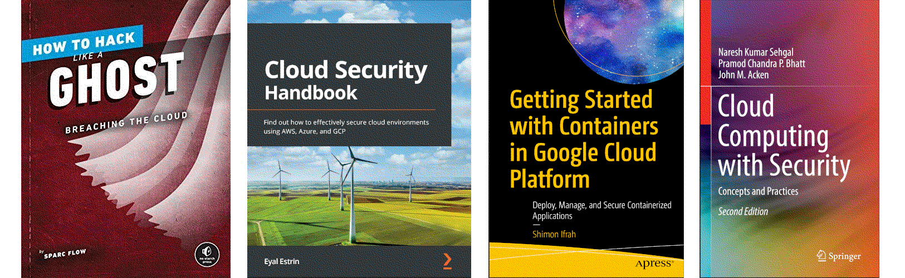

Head in the clouds
==============================================

Virtualisation technology in the cloud has become a huge resource to leverage, as it promises high availability and access to resources from anywhere. From individuals, enterprises to large conglomerates, nearly everyone is migrating towards the cloud. With this come often unseen threats because cloud environments are different from the traditional infrastructure.

.. image:: _static/images/in-progress.png
  :alt: Forever in progress ...

----

.. toctree::
   :maxdepth: 1
   :includehidden:
   :caption: Test lab

   AWS tools <https://red.tymyrddin.dev/projects/testlab/en/latest/docs/cloud/aws.html>

----

.. toctree::
   :maxdepth: 1
   :includehidden:
   :caption: Preparation

   Reconnaissance <https://red.tymyrddin.dev/projects/recon/en/latest/docs/cloud/README.html>
   Enumeration <https://red.tymyrddin.dev/projects/enum/en/latest/docs/system/cloud.html>

----

.. toctree::
   :maxdepth: 1
   :includehidden:
   :caption: Notes on techniques

   docs/notes/README.md
   docs/notes/challenges.md
   docs/notes/accounts.md
   docs/notes/cloud-centric.md
   docs/notes/misconfigurations.md
   docs/notes/cicd.md

----

Pentester Academy: Attacking and defending AWS
--------------------------------------------------

With millions of active customers, Amazon Web Services (AWS) is one of the most popular cloud service providers, and due to the same reason, it is of prime importance to hackers. Gaining access to one such corporate AWS account can cost a company billions of dollars, and users their privacy and perhaps even their identity.

.. toctree::
   :maxdepth: 1
   :includehidden:
   :caption: IAM

   docs/iam/README.md
   docs/iam/enum-iam.md
   docs/iam/mis-trust-policy.md
   docs/iam/overly-permissive-1.md
   docs/iam/dangerous-policy-1.md
   docs/iam/dangerous-policy-2.md
   docs/iam/overly-permissive-2.md
   docs/iam/pass-role-ec2.md
   docs/iam/pass-role-lambda.md
   docs/iam/pass-role-formation.md

.. toctree::
   :maxdepth: 1
   :includehidden:
   :caption: API Gateway

   docs/api/README.md
   docs/api/api-gateway-enum.md
   docs/api/verb-tampering.md
   docs/api/mis-private-api.md
   docs/api/iam-auth.md
   docs/api/dos.md
   docs/api/poor-lambda-authoriser.md

----

.. toctree::
   :glob:
   :maxdepth: 1
   :includehidden:
   :caption: More

   Bust-a-Kube <https://www.bustakube.com/>
   flAWS 2 <http://flaws2.cloud/>
   AWSGoat <https://github.com/ine-labs/AWSGoat>
   CloudGoat <https://github.com/RhinoSecurityLabs/cloudgoat>

----

